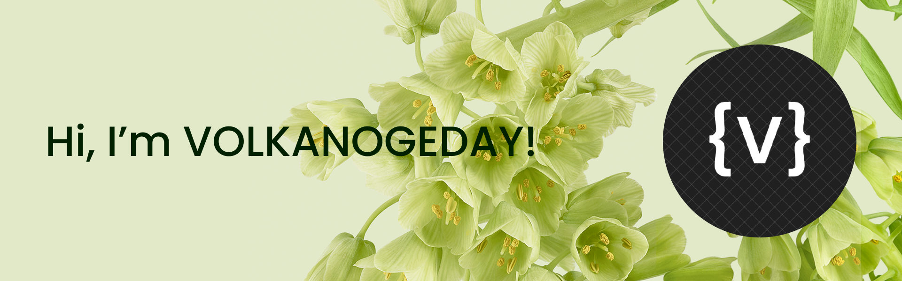

### Hello World ✨

I'm a 14 year old guy who loves coding, music, piano and designing. I'm currently learning C# and working on a project called SocialSpace which is an app to merge social media experience in one place.  

### Socials📱

### Languages & Tools 🛠️

### My Stats 📈
<a href="https://github.com/volkanogeday">
  <table href="https://github.com/volkanogeday" width="100%">
    <td width="50%" style="border: none">
      
    </td>
    <td width="50%" style="border: none">
      
    </td>
  </table>
</a>

